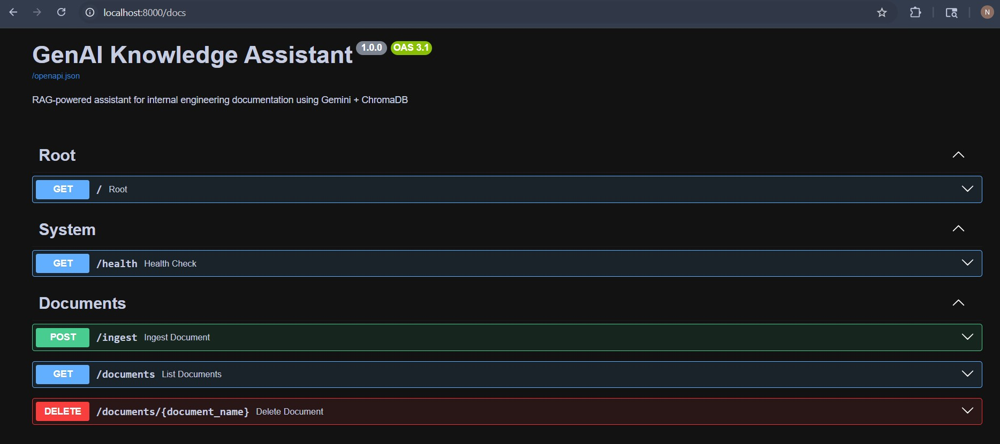
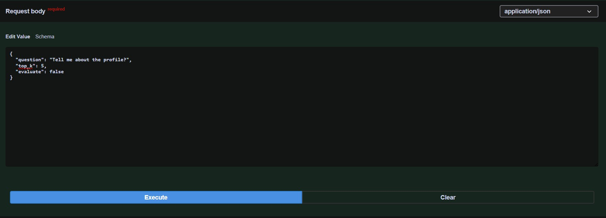
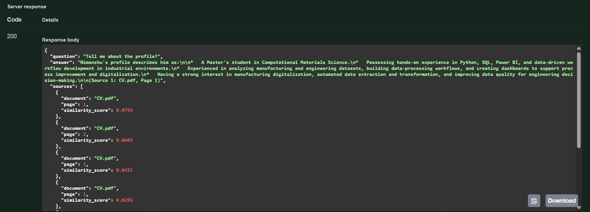

# genai-knowledge-assistant
Production-style RAG API for PDF ingestion, semantic retrieval, and grounded question answering using FastAPI, ChromaDB, sentence-transformers, and Gemini.


# GenAI Knowledge Assistant

A production-style **RAG (Retrieval-Augmented Generation)** application built with **FastAPI**, **ChromaDB**, **sentence-transformers**, and **Gemini** for answering questions over PDF documents.

The system allows users to upload PDFs, extract and chunk their contents, store embeddings in a vector database, and ask natural-language questions grounded in the ingested documents.

---

## Features

- Upload and ingest PDF documents
- Extract text using **PyMuPDF**
- Split documents into overlapping chunks
- Generate embeddings locally using **sentence-transformers**
- Store and retrieve chunks using **ChromaDB**
- Ask questions through a FastAPI endpoint
- Return answers with source references
- Interactive API testing through **Swagger UI**
- Optional answer quality evaluation

---

## Tech Stack

- **FastAPI** — REST API framework
- **Uvicorn** — ASGI server
- **PyMuPDF** — PDF text extraction
- **ChromaDB** — persistent vector database
- **sentence-transformers** — local embedding model
- **Gemini** — answer generation
- **Pydantic** — request and response validation
- **python-dotenv** — environment variable management
- **LangChain Text Splitters** — chunking strategy

---

## Architecture

```text
PDF Upload → Text Extraction → Chunking → Embedding Generation → Vector Storage
                                                               ↓
User Question → Semantic Retrieval from ChromaDB → Context Assembly
                                                               ↓
                                            Gemini → Final Answer + Sources
```

## 📁Project Structure

```text
genai-knowledge-assistant/
├── app/
│   ├── main.py          # FastAPI routes & app setup
│   ├── config.py        # Settings from .env
│   ├── ingestion.py     # PDF parsing & chunking
│   ├── vectorstore.py   # ChromaDB vector operations
│   ├── llm.py           # Gemini answer generation
│   ├── evaluator.py     # Response quality evaluation
│   └── schemas.py       # Pydantic request/response models
├── data/
│   ├── documents/       # Uploaded PDFs stored here
│   └── vectorstore/     # ChromaDB persistent storage
├── tests/
│   └── test_api.py      # Integration tests
├── .env.example         # Environment variables template
├── requirements.txt
└── README.md

```
---


### API Endpoints
| Method | Endpoint | Description |
|---|---|---|
| GET | `/` | API info |
| GET | `/health` | Health check |
| POST | `/ingest` | Upload and ingest a PDF |
| POST | `/query` | Ask a question using RAG |
| GET | `/documents` | List ingested documents |
| DELETE | `/documents/{document_name}` | Delete a document |
| GET | `/search` | Raw semantic search |

---

## UI
Interactive API documentation is available at:
http://localhost:8000/docs

---


## Screenshots

### UI


### Question


### Response


---


## How It Works
1.A PDF is uploaded through the /ingest endpoint. \
2.Text is extracted from the PDF using PyMuPDF. \
3.The content is split into overlapping chunks. \
4.Each chunk is converted into embeddings using sentence-transformers. \
5.The embeddings are stored in ChromaDB. \
6.When a user asks a question, the system retrieves the most relevant chunks. \
7.The retrieved context is passed to Gemini to generate a grounded answer. \
8.The API returns the final answer along with source information. 

---

## Requirements
fastapi==0.115.0 \
uvicorn==0.30.6 \
python-multipart==0.0.9 \
pydantic==2.8.2 \
pymupdf==1.24.9 \
chromadb==0.5.5 \
sentence-transformers==3.0.1 \
google-generativeai==0.7.2 \
python-dotenv==1.0.1 \
langchain-text-splitters==0.2.4 

---

## Running the Application
1. Start the FastAPI server: \
    uvicorn app.main:app --reload --host 0.0.0.0 --port 8000

2. Then open: \
     http://localhost:8000/docs

---

## Example Usage

1. Ingest a PDF \
   curl -X POST "http://localhost:8000/ingest" \
  -F "file=@sample_docs/demo.pdf"

2. Ask a Question \
   curl -X POST "http://localhost:8000/query" \
  -H "Content-Type: application/json" \
  -d '{
    "question": "What does this document say about the workflow?",
    "top_k": 5,
    "evaluate": false
  }'

3. Example Response \
   {
  "question": "What does this document say about the workflow?", \
  "answer": "The document explains that the workflow begins with document ingestion, followed by chunking, semantic retrieval, and answer generation.", \
  "sources": [
    {
      "document": "demo.pdf",
      "page": 1,
      "similarity_score": 0.91
    }
  ]
}

---


